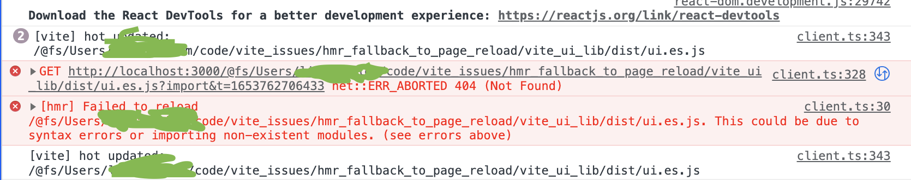

# vite HMR fail and disconnect due to file system race condition(?)

story:
developer works on main project of company. and uses company npm scopped lib configure vite project. after few edits of one of the components `button.tsx` vite's HMR fail with an error

the `non-existing-file` is probably a file that was deleted and re-written by vite or it's deps (maybe `vite-plugin-dts`)

reproduce:
1. clone project
2. `cd main_project`
2.1 `npm link`
2.2 `npm run dev`
3. `cd vite_ui_lib`
3.1 `npm link @vite_ui_lib/ui` # <--- create symbolic link for local development
3.2 `npm run start`
3.4 edit `button.tsx` content (e.g edit the text inside the button.) <--- do so fast and multipile times till you get the error

at the editing part of `button.tsx` you'll need to play around with it and edit it many times and different sizes (essentialy causing a some kind of race coniditon in the file system).

